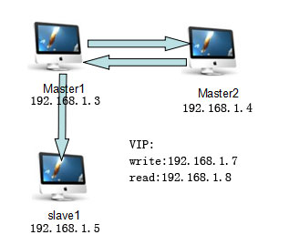

# 使用mysql-mmm实现MySQL高可用集群

系统架构：



参考：
节点 | 角色 | MYSQL  | IP | 备注
---|---|---|---|---
vm03 | mysql master| MariaDB-10.0.35  | 192.168.1.3 | 主数据库
vm04 | mysql master| MariaDB-10.0.35  | 192.168.1.4 | 主数据库
vm05 | mysql slave | MariaDB-10.0.35  | 192.168.1.5 | 从数据库
**系统版本：centos6.9**
**VIP地址：write：192.168.1.7 read:192.168.1.8**
**mysql端口为:61920**

## 一、安装mysql-mmm（三台机器都操作）
```
# rpm -Uvh http://dl.fedoraproject.org/pub/epel/6/x86_64/epel-release-6-8.noarch.rpm
# yum -y install mysql-mmm*
```
验证：
```
完成后查看  
# rpm -qa|grep mysql-mmm
mysql-mmm-monitor-2.2.1-2.el6.noarch
mysql-mmm-2.2.1-2.el6.noarch
mysql-mmm-agent-2.2.1-2.el6.noarch
mysql-mmm-tools-2.2.1-2.el6.noarch
有以上组件表示安装成功
```
```
Rhel5或centos5,32位：http://dl.fedoraproject.org/pub/epel/5/i386/epel-release-5-4.noarch.rpm
Rhel6或centos6,32位：http://dl.fedoraproject.org/pub/epel/6/i386/epel-release-6-5.noarch.rpm
Rhel6或centos6,64位：http://dl.fedoraproject.org/pub/epel/6/x86_64/epel-release-6-8.noarch.rpm
```

## 二、添加mysql的用户和配置主从设置

1.在三台机器都添加mysql用户，分别用于复制和监控

```
#建立复制用户
# mysql -p123456 -u root -e "grant REPLICATION slave,REPLICATION CLIENT on *.* to 'slave'@'192.168.1.%' identified by 'slave123456';"

#建立agent用户
# mysql -p123456 -u root -e "grant PROCESS,SUPER,REPLICATION CLIENT on *.* to 'mmm_agent'@'192.168.1.%' identified by 'agent123456';"

#建立用户
# mysql -p123456 -u root -e "grant REPLICATION CLIENT on *.* to 'mmm_monitor'@'192.168.1.%' identified by 'monitor123456';"

# mysql -p123456 -u root -e "FLUSH PRIVILEGES;"
```
2、修改hosts
分别修改三台机器的hosts文件
```
echo "192.168.1.3 vm03 master1.mysqlmmm.com
192.168.1.4 vm04 master2.mysqlmmm.com
192.168.1.5 vm05 slave.mysqlmmm.com">> /etc/hosts
```

3.配置同步复制
vm03和vm04互为主从， vm03和vm05为主从。
略，参考[Mysql数据库主从配置](https://github.com/funet8/MYSQL/wiki/Mysql%25E6%2595%25B0%25E6%258D%25AE%25E5%25BA%2593%25E4%25B8%25BB%25E4%25BB%258E%25E9%2585%258D%25E7%25BD%25AE)

4、配置mysql-mmm
修改 /etc/mysql-mmm/mmm_common.conf  各台机子的配置都一样

```
active_master_role      writer

<host default>
    cluster_interface       eth2
    pid_path                /var/run/mysql-mmm/mmm_agentd.pid
    bin_path                /usr/libexec/mysql-mmm/
    replication_user        slave
    replication_password    slave123456
    agent_user              mmm_agent
    agent_password          agent123456
	mysql_port              61920
</host>

<host vm03>
    ip      192.168.1.3
    mode    master
    peer    vm04
</host>

<host vm04>
    ip      192.168.1.4
    mode    master
    peer    vm03
</host>

<host vm05>
    ip      192.168.1.5
    mode    slave
</host>

<role writer>
    hosts   vm03,vm04
    ips     192.168.1.7
    mode    exclusive
</role>

<role reader>
    hosts   vm03,vm04,vm05
    ips     192.168.1.8
    mode    balanced
</role>
```
注意：192.168.1.7和192.168.1.8是两个虚拟的IP地址，供应用程序调用，只需用两个没人占用的IP就可以，分别用来提供写和读服务，为以后实现数据库的读写分离（但实现读写分离需要修改应用程序，mysql并不能自动识别并切换）。

修改/etc/mysql-mmm/mmm_agent.conf
三台机器分别设置为this vm03、this vm04、this vm05

修改/etc/mysql-mmm/mmm_mon.conf
只是monitor（192.168.1.3）机子需要配置
```
include mmm_common.conf
<monitor>
    ip                  127.0.0.1
    pid_path            /var/run/mysql-mmm/mmm_mond.pid
    bin_path            /usr/libexec/mysql-mmm
    status_path         /var/lib/mysql-mmm/mmm_mond.status
    ping_ips            192.168.1.3,192.168.1.4,192.168.1.5
    auto_set_online     10

    # The kill_host_bin does not exist by default, though the monitor will
    # throw a warning about it missing.  See the section 5.10 "Kill Host 
    # Functionality" in the PDF documentation.
    #
    # kill_host_bin     /usr/libexec/mysql-mmm/monitor/kill_host
    #
</monitor>
<host default>
    monitor_user        mmm_monitor
    monitor_password    monitor123456
</host>
debug 0
```
配置完成后运行
```
三台机子都需运行：
/etc/init.d/mysql-mmm-agent start
monitor（192.168.1.3）机子运行
/etc/init.d/mysql-mmm-monitor start

```

5、查看服务状态及测试
在monitor机子运行mmm_control show
可以看到以下信息：
```
[root@vm03 ~]# mmm_control show
  vm03(192.168.1.3) master/ONLINE. Roles: writer(192.168.1.7)
  vm04(192.168.1.4) master/ONLINE. Roles: reader(192.168.1.8)
  vm05(192.168.1.5) slave/ONLINE. Roles: 
```
查看各个服务的状态：
```
[root@vm03 ~]# mmm_control checks all
vm04  ping         [last change: 2018/05/22 11:03:19]  OK
vm04  mysql        [last change: 2018/05/22 11:03:19]  OK
vm04  rep_threads  [last change: 2018/05/22 11:03:19]  OK
vm04  rep_backlog  [last change: 2018/05/22 11:03:19]  OK: Backlog is null
vm05  ping         [last change: 2018/05/22 11:03:19]  OK
vm05  mysql        [last change: 2018/05/22 11:03:19]  OK
vm05  rep_threads  [last change: 2018/05/22 11:03:19]  OK
vm05  rep_backlog  [last change: 2018/05/22 11:03:19]  OK: Backlog is null
vm03  ping         [last change: 2018/05/22 11:03:19]  OK
vm03  mysql        [last change: 2018/05/22 11:03:19]  OK
vm03  rep_threads  [last change: 2018/05/22 11:03:19]  OK
vm03  rep_backlog  [last change: 2018/05/22 11:03:19]  OK: Backlog is null
```
6、测试：
将master1的mysql服务停止，然后mmm_control show查看状态
```
[root@vm03 ~]# mmm_control show
  vm03(192.168.1.3) master/HARD_OFFLINE. Roles: 
  vm04(192.168.1.4) master/ONLINE. Roles: writer(192.168.1.7)
  vm05(192.168.1.5) slave/ONLINE. Roles: reader(192.168.1.8)
此时
vm05的主数据库为192.168.1.4
Master_Host: 192.168.1.4
```
```
# mysql -u root -h192.168.1.7 -p123456
创建数据库和相应操作
```
将master1（vm03） 的mysql服务启动，再查看状态：
```
[root@vm03 ~]# mmm_control show
  vm03(192.168.1.3) master/ONLINE. Roles: 
  vm04(192.168.1.4) master/ONLINE. Roles: writer(192.168.1.7)
  vm05(192.168.1.5) slave/ONLINE. Roles: reader(192.168.1.8)
```
将master2（vm04） 的mysql服务启动，再查看状态：
```
[root@vm03 ~]# mmm_control show
  vm03(192.168.1.3) master/ONLINE. Roles: writer(192.168.1.7)
  vm04(192.168.1.4) master/HARD_OFFLINE. Roles: 
  vm05(192.168.1.5) slave/ONLINE. Roles: reader(192.168.1.8)
vm05的主数据库为192.168.1.3
Master_Host: 192.168.1.3
```


