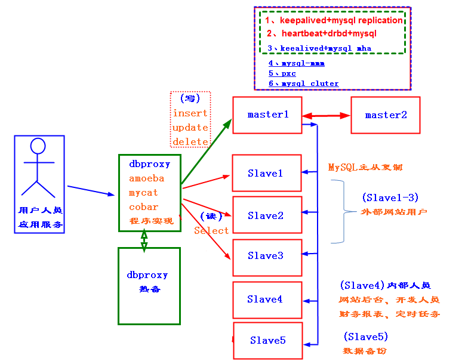
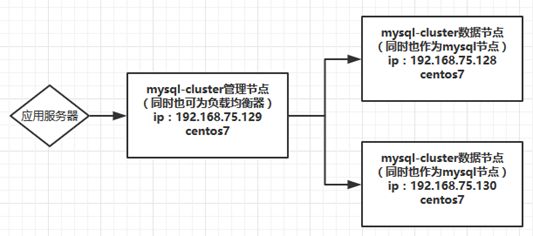
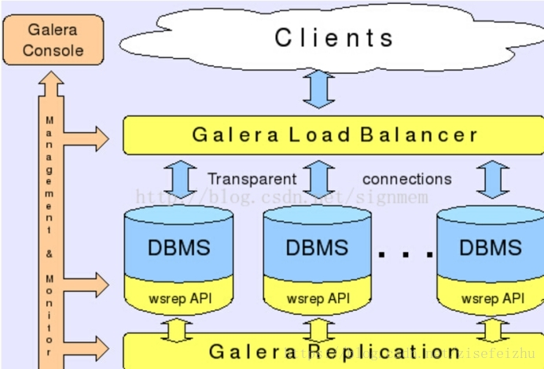
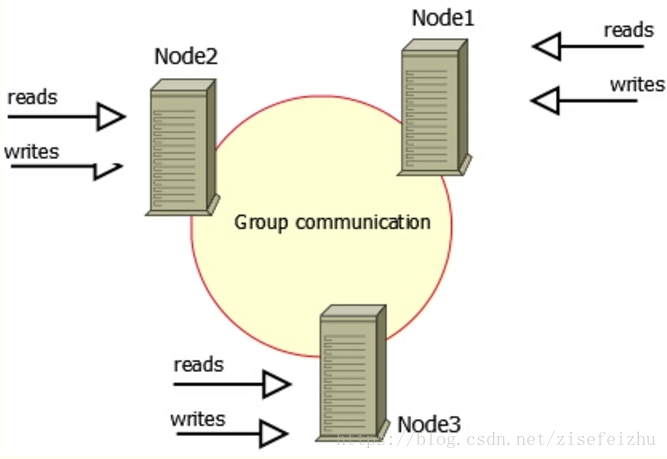

# mysql数据库集群

mysql数据库集群主要有2种常用方案：

## replication:
速度快、弱一致性、适合保存低价值的数据，主要应用于日志、新闻、帖子等系统。

## PXC：
percona xtradb cluster，简称PXC

速度慢、强一致性、适合保存高价值的数据，主要应用于订单、银行账户、财务等系统。

replication读写分离，主写从读，使用异步复制。

PXC每一个数据库都可读可写，使用同步复制。

**PXC方案只支持Innodb类型同步**

# mysql集群架构图片
https://www.cnblogs.com/yangliheng/p/5871208.html

数据库服务器---数据库（多个实例）---多个库---多个表---多个字段行列（数据）

在一台数据库服务器上可以跑多个实例，一个实例中有多个库，一个库有多个表，一个表有多个行列。

#  [MySQL集群的可行方案](https://www.cnblogs.com/zhishan/p/3385631.html)

如果单MySQL的优化始终还是顶不住压力时，这个时候我们就必须考虑MySQL的高可用架构(很多同学也爱说成是MySQL集群)了，目前可行的方案有： 

## 一、MySQL Cluster
优势：可用性非常高，性能非常好。每份数据至少可在不同主机存一份拷贝，且冗余数据拷贝实时同步。但它的维护非常复杂，存在部分Bug，目前还不适合比较核心的线上系统，所以这个我不推荐。 

## 二、DRBD磁盘网络镜像方案
优势：软件功能强大，数据可在底层快设备级别跨物理主机镜像，且可根据性能和可靠性要求配置不同级别的同步。IO操作保持顺序，可满足数据库对数据一致性的苛刻要求。但非分布式文件系统环境无法支持镜像数据同时可见，性能和可靠性两者相互矛盾，无法适用于性能和可靠性要求都比较苛刻的环境，维护成本高于MySQL Replication。另外，DRBD也是官方推荐的可用于MySQL高可用方案之一，所以这个大家可根据实际环境来考虑是否部署。 

## 三、MySQL Replication
在实际应用场景中，MySQL Replication是使用最为广泛的一种提高系统扩展性的设计手段。众多的MySQL使用者通过Replication功能提升系统的扩展性后，通过简单的增加价格低廉的硬件设备成倍 甚至成数量级地提高了原有系统的性能，是广大MySQL中低端使用者非常喜欢的功能之一，也是许多MySQL使用者选择MySQL最为重要的原因。

比较常规的MySQL Replication架构也有好几种，这里分别简单说明下

### MySQL Replication架构一：

常规复制架构--Master-slaves，是由一个Master复制到一个或多个Salve的架构模式，主要用于读压力大的应用数据库端廉价扩展解决方案，读写分离，Master主要负责写方面的压力。 

### MySQL Replication架构二：

             级联复制架构，即Master-Slaves-Slaves,这个也是为了防止Slaves的读压力过大，而配置一层二级 Slaves，很容易解决Master端因为附属slave太多而成为瓶劲的风险。

### MySQL Replication架构三：

             Dual Master与级联复制结合架构，即Master-Master-Slaves，最大的好处是既可以避免主Master的写操作受到Slave集群的复制带来的影响，而且保证了主Master的单点故障。

以上就是比较常见的MySQL replication架构方案，大家可根据自己公司的具体环境来设计 ，Mysql 负载均衡可考虑用LVS或Haproxy来做，高可用HA软件我推荐Heartbeat。

## MySQL Replication的不足：

    如果Master主机硬件故障无法恢复，则可能造成部分未传送到slave端的数据丢失。所以大家应该根据自己目前的网络规划，选择自己合理的Mysql架构方案，跟自己的MySQL DBA和程序员多沟涌，多备份(备份我至少会做到本地和异地双备份)，多测试，数据的事是最大的事，出不得半点差错，切记切记。

# [手把手教你用Mysql-Cluster-7.5搭建数据库集群](https://www.cnblogs.com/linkstar/p/6510713.html)

## 架构图及说明

## mysql cluster中的几个概念解释

为了简单，我后面简称mysql-cluster为mc。
1、mc已经包含了mysql，我下载的最新的mc7.5，官方说明包含的是mysql版本是5.7。所以不需要使用别的msyql的安装包安装数据库。同时注意mysql5.7的版本在安装的命令和配置上面和之前的版本有很大的不同，所以网上有很多mc7.5之前的版本，所包含的mysql版本不同，所以安装方法不同。

2、管理节点，mc管理节点负责管理、配置、监控整个集群。

3、数据节点，使用内存存放数据，保存进数据节点的数据都会自动复制并存储到其他数据节点。

4、mysql节点，也叫数据库节点，和我们平时使用的mysql相同，作为数据库使用。被数据节点访问。

**唯一需要注意的是，创建表的时候必须选择表的引擎为NDBCLUSTER，否则表不会进行同步**

# [带你玩转Mysql高可用方案--PXC](https://blog.csdn.net/zisefeizhu/article/details/81873466#%E5%9F%BA%E4%BA%8EGalere%E5%8D%8F%E8%AE%AE%E7%9A%84%E9%AB%98%E5%8F%AF%E7%94%A8%E6%96%B9%E6%A1%88%EF%BC%9Apxc)

Galera是Codership提供的多主数据同步复制机制，可以实现多个节点间的数据同步复制以及读写，并且可保障数据库的服务高可用及数据一致性。

基于Galera的高可用方案主要有MariaDB Galera Cluster和Percona XtraDB Cluster（简称PXC），目前PXC用的会比较多一些。

mariadb的集群原理跟PXC一样,maridb-cluster其实就是PXC，两者原理是一样的。

## PXC的架构示意图

## 数据读写示意图

## PXC介绍
Percona XtraDB Cluster（简称PXC集群）提供了MySQL高可用的一种实现方法。

1）集群是有节点组成的，推荐配置至少3个节点，但是也可以运行在2个节点上。

2）每个节点都是普通的mysql/percona服务器，可以将现有的数据库服务器组成集群，反之，也可以将集群拆分成单独的服务器。

3）每个节点都包含完整的数据副本。

PXC集群主要由两部分组成：Percona Server with XtraDB和Write Set Replication patches（使用了Galera library，一个通用的用于事务型应用的同步、多主复制插件）。

